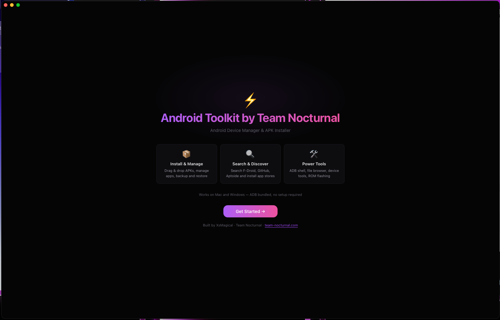
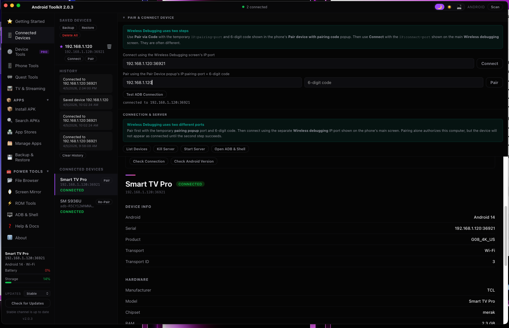
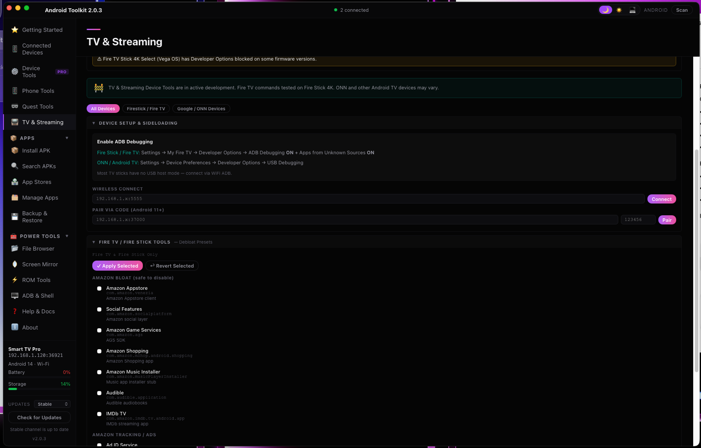
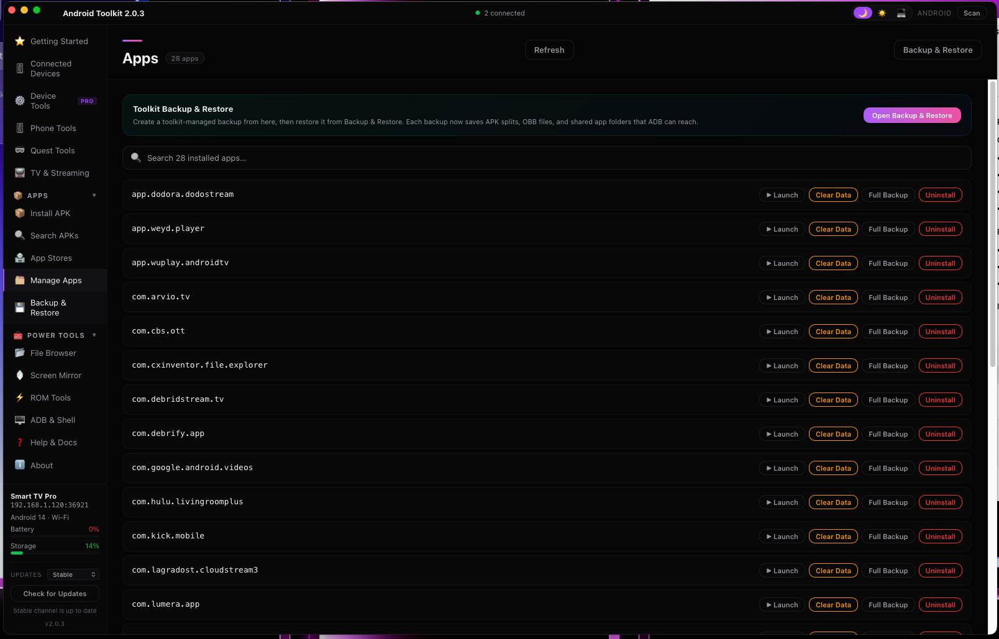

<div align="center">


# Android Toolkit by Team Nocturnal

### A cleaner control center for sideloading, ADB, Fastboot, TV streaming tools, Quest workflows, backups, and Android power-user tasks.

[Official Site](https://toolkit.team-nocturnal.com) • [Forum Thread](https://forums.wbodytech.com/%E2%9A%A1-nocturnal-toolkit-by-team-nocturnal.t239/) • [Changelog](./CHANGELOG.md) • [All Releases](https://github.com/TeamNocturnal/AndroidToolkit/releases)

`macOS` `Windows` `Linux` `Android` `Tauri 2` `Rust` `React` `Vite`

</div>

> Android Toolkit started as a simpler install-and-ADB helper, but it has grown into a full desktop and Android management suite for phones, tablets, TVs, Quest headsets, sideloading, backups, wireless debugging, maintenance, and recovery work.

## Visual Snapshot

<p align="center">
  
  
</p>

<p align="center">
  
  
</p>

| Brand | Mood | Focus |
| --- | --- | --- |
| Dark glass styling, Team Nocturnal branding, and a desktop-first layout modeled after the website. | Built to feel more like a polished toolkit dashboard than a generic utility wrapper. | Device setup, TV tools, app management, and power-user Android workflows in one visual surface. |

## Quick Start

| Track | Link | Use It For |
| --- | --- | --- |
| Stable | [Latest stable release](https://github.com/TeamNocturnal/AndroidToolkit/releases/latest) | Normal installs and public release builds |
| Nightly | [Nightly and preview releases](https://github.com/TeamNocturnal/AndroidToolkit/releases) | Latest fixes, newest tooling, and in-progress features |

## Why It Pops

| Area | What You Get |
| --- | --- |
| Device Control | USB + wireless ADB, pairing flows, saved devices, transport details, recovery shortcuts |
| Apps & Stores | APK queue installs, split package handling, app stores, package tools, app management |
| TV & Streaming | Fire TV, Android TV, Google TV, Shield, ONN, launcher tools, guided setup, media installs |
| Power Tools | File browser, backups, cleanup, diagnostics, tweaks, ROM tools, shell access |
| Quest | Quest-focused sideloading and headset setup flows |
| Android App | Mobile-first toolkit flow with local shell, logcat, install, and maintenance tools |

## Experience

| Look | Workflow | Audience |
| --- | --- | --- |
| Dark, branded, TV-friendly, and desktop-focused | Install, connect, sideload, manage, tweak, back up, and recover from one place | Power users, streamers, Android TV users, Quest users, and anyone tired of juggling shell commands |

## Install Android Toolkit

### macOS

| Download | Install |
| --- | --- |
| Grab the `.dmg` that matches your Mac: `aarch64` / `arm64` for Apple Silicon, `x86_64` for Intel. | 1. Download the `.dmg`  2. Open it  3. Drag `Android Toolkit.app` into `Applications`  4. Launch it from `Applications` |

> macOS note: builds are ad-hoc signed and not notarized yet. If Gatekeeper blocks the DMG or app, open `System Settings` -> `Privacy & Security` -> `Open Anyway`, then launch again. You may need to approve the DMG once and the app once.

### Windows

| Download | Install |
| --- | --- |
| Use either the `.exe` installer or the `.msi` package from the release page. | 1. Download the Windows asset  2. Run the `.exe` or open the `.msi`  3. Follow setup prompts  4. Launch `Android Toolkit` from Start or the desktop shortcut |

> Windows note: if SmartScreen warns on first launch, click `More info`, then `Run anyway`.

### Linux

| Distro Family | Preferred Package |
| --- | --- |
| Debian / Ubuntu / Linux Mint / Pop!_OS / KDE Neon | `.deb` |
| Fedora / openSUSE | `.rpm` |
| Arch Linux / EndeavourOS / Manjaro | `AppImage` |

Nightly Linux releases use filenames like:

- `Android-Toolkit_2.0.3_nightly-YYYYMMDD-HHMMSS_amd64.deb`
- `Android-Toolkit_2.0.3_nightly-YYYYMMDD-HHMMSS_amd64.AppImage`
- `Android-Toolkit_2.0.3_nightly-YYYYMMDD-HHMMSS_x86_64.rpm`

<details>
<summary><strong>Debian / Ubuntu / Linux Mint / Pop!_OS / Zorin / KDE Neon</strong></summary>

Option 1: install from `Downloads`.

```bash
cd ~/Downloads
sudo apt update
sudo apt install ./Android-Toolkit_<version>_amd64.deb
```

Option 2: type the command, then drag the `.deb` file into Terminal so your desktop pastes the exact path.

```bash
sudo apt install 
```

</details>

<details>
<summary><strong>Fedora</strong></summary>

Option 1: install from `Downloads`.

```bash
cd ~/Downloads
sudo dnf install ./Android-Toolkit-<version>-1.x86_64.rpm
```

Option 2: type the command, then drag the `.rpm` file into Terminal.

```bash
sudo dnf install 
```

</details>

<details>
<summary><strong>openSUSE</strong></summary>

Option 1: install from `Downloads`.

```bash
cd ~/Downloads
sudo zypper install ./Android-Toolkit-<version>-1.x86_64.rpm
```

Option 2: type the command, then drag the `.rpm` file into Terminal.

```bash
sudo zypper install 
```

</details>

<details>
<summary><strong>Arch Linux / EndeavourOS / Manjaro</strong></summary>

Option 1: launch it from `Downloads`.

```bash
cd ~/Downloads
chmod +x Android-Toolkit-*.AppImage
./Android-Toolkit-*.AppImage
```

Option 2: type each command first, then drag the AppImage into Terminal so it pastes the full path.

```bash
chmod +x 
./
```

If you are on Wayland with NVIDIA and an older nightly aborts before the window opens, retry it once with:

```bash
WEBKIT_DISABLE_DMABUF_RENDERER=1 ./
```

</details>

> Linux notes:
> - If your app menu does not refresh after install, sign out and back in once or restart the desktop shell/session.
> - Linux packages and launchers are bundled under the `Utility` category so they land in a normal Utilities-style menu section instead of `Lost & Found`.

## Toolkit At A Glance

| Section | Highlights |
| --- | --- |
| Apps | `Install APK`, split package support, APK search, app stores, app management |
| Devices | USB + wireless ADB, pairing, saved devices, battery and storage details |
| Media | TV and streaming setup, launcher tools, media app installs, device-specific flows |
| Power Tools | File browser, backups, cleanup, diagnostics, tweaks, ROM tools |
| Pro Tools | `ADB & Shell`, reboot modes, quick commands, package and permission controls |
| Android App | Local shell, logcat, installs, maintenance, and Android-specific UX |

## Tech Stack

| Layer | Stack |
| --- | --- |
| App Shell | `Tauri 2` |
| Frontend | `JavaScript`, `React`, `Vite` |
| Native Layer | `Rust` |
| Device Tools | Bundled `adb` and `fastboot` binaries |

## Project Links

- Official site: [toolkit.team-nocturnal.com](http://toolkit.team-nocturnal.com)
- Changelog: [CHANGELOG.md](./CHANGELOG.md)
- Stable download: [releases/latest](https://github.com/TeamNocturnal/AndroidToolkit/releases/latest)
- Nightly builds: [releases](https://github.com/TeamNocturnal/AndroidToolkit/releases)

## macOS Setup

### Requirements

- `Node.js` + `npm`
- `Rust`
- `Xcode Command Line Tools`

Official links:

- Node.js: [https://nodejs.org](https://nodejs.org)
- Rust / rustup: [https://rustup.rs](https://rustup.rs)
- Xcode Command Line Tools: [https://developer.apple.com/xcode/resources/](https://developer.apple.com/xcode/resources/)

Install the common prerequisites:

```bash
xcode-select --install
brew install node
curl https://sh.rustup.rs -sSf | sh
```

Restart your terminal after installing Rust, or run:

```bash
source "$HOME/.cargo/env"
```

### Run In Dev Mode

```bash
npm run tauri dev
```

### Build macOS App

```bash
npm run tauri build
```

Expected output:

- `src-tauri/target/release/bundle/macos/Android Toolkit.app`
- `src-tauri/target/release/bundle/dmg/Android Toolkit_<version>_<arch>.dmg`

### Build macOS App For Distribution

```bash
npm run build:mac
```

This ad-hoc build flow:

- builds the macOS `.app` bundle with `Tauri`
- signs the `.app` with `codesign --force --deep --options runtime -s -`
- creates a DMG using `create-dmg`
- signs the final `.dmg` with an ad-hoc identity

Install `create-dmg` first:

```bash
brew install create-dmg
```

### Notes For macOS

- The macOS bundle config uses `bundle.macOS.signingIdentity` set to `"-"` so ad-hoc signing is the default identity for local macOS bundles.
- Ad-hoc signing should produce the standard "Unidentified Developer" warning on other Macs instead of a damaged-app error, but it does not notarize the app.
- For fully trusted public distribution without the extra Gatekeeper confirmation flow, you still need a valid Apple `Developer ID Application` certificate and notarization.

### If macOS Blocks The DMG Or App

Because the current macOS build is ad-hoc signed and not notarized, Gatekeeper may block it the first time.

You may need to do this twice:

1. For the DMG installer
2. Again for the app the first time you open `Android Toolkit.app`

Use this flow each time macOS blocks it:

1. Try to open the blocked `.dmg` or `.app`
2. When macOS shows the warning, click `Done`
3. Open `System Settings`
4. Go to `Privacy & Security`
5. Scroll down to the `Security` section
6. Click `Open Anyway` for the blocked item
7. Confirm the prompt and open it again

If you install from the DMG, expect to repeat the same `Open Anyway` process once for the installer and once again for the app itself on first launch.

## Windows Setup

### Requirements

- `Node.js` + `npm`
- `Rust`
- `Visual Studio Build Tools` with C++ workload
- `WebView2` runtime

Recommended installs:

- Node.js: [https://nodejs.org](https://nodejs.org)
- Rust: [https://rustup.rs](https://rustup.rs)
- Visual Studio Build Tools: [https://visualstudio.microsoft.com/visual-cpp-build-tools/](https://visualstudio.microsoft.com/visual-cpp-build-tools/)
- WebView2: [https://developer.microsoft.com/en-us/microsoft-edge/webview2/](https://developer.microsoft.com/en-us/microsoft-edge/webview2/)

### Recommended Local Path

```powershell
mkdir C:\Projects
cd C:\Projects
git clone https://github.com/TeamNocturnal/AndroidToolkit.git
cd AndroidToolkit
npm install
```

### Run In Dev Mode

```powershell
npm run tauri dev
```

### Build Windows App

```powershell
npm run tauri build
```

### Notes For Windows

- If you plan to build Android on Windows too, keep your Android SDK / NDK / Java paths configured in your environment first.
- The older environment notes in [WINDOWS_ENV.md](/Users/xs/Library/CloudStorage/OneDrive-Personal/Team%20Nocturnal/Projects/Nocturnal%20Toolkit/WINDOWS_ENV.md) are still useful as a machine-specific reference.

## Linux Setup

Linux desktop builds are now supported for `x86_64` systems, including `Debian`, `Fedora`, `Arch Linux`, and `openSUSE`.

### Requirements

- `Node.js` + `npm`
- `Rust`
- Tauri Linux system dependencies
- `xdg-open` support from your desktop environment for reveal-in-folder actions

Official links:

- Node.js: [https://nodejs.org](https://nodejs.org)
- Rust / rustup: [https://rustup.rs](https://rustup.rs)
- Tauri Linux prerequisites: [https://v2.tauri.app/start/prerequisites/](https://v2.tauri.app/start/prerequisites/)
- Android SDK Platform-Tools: [https://developer.android.com/tools/releases/platform-tools](https://developer.android.com/tools/releases/platform-tools)

Install the common app dependencies first, then the distro-specific packages below.

### Debian

Based on the current Tauri v2 prerequisites:

```bash
sudo apt update
sudo apt install \
  libwebkit2gtk-4.1-dev \
  build-essential \
  curl \
  wget \
  file \
  libxdo-dev \
  libssl-dev \
  libayatana-appindicator3-dev \
  librsvg2-dev \
  nodejs \
  npm
curl --proto '=https' --tlsv1.2 https://sh.rustup.rs -sSf | sh
source "$HOME/.cargo/env"
npm -v
node -v
```

If you want a quick ADB check on Debian before opening the app:

```bash
adb version
adb devices
```

### Arch Linux

Based on the current Tauri v2 prerequisites:

```bash
sudo pacman -Syu
sudo pacman -S npm
npm -v
sudo pacman -S --needed \
  webkit2gtk-4.1 \
  base-devel \
  curl \
  wget \
  file \
  openssl \
  appmenu-gtk-module \
  libappindicator-gtk3 \
  librsvg \
  xdotool \
  nodejs \
  npm
curl --proto '=https' --tlsv1.2 https://sh.rustup.rs -sSf | sh
source "$HOME/.cargo/env"
node -v
npm -v
```

If `npm` was not already present on your Arch system, the minimal install flow is:

```bash
sudo pacman -Syu
sudo pacman -S npm
npm -v
```

If you want a quick ADB check on Arch before opening the app:

```bash
adb version
adb devices
```

### Fedora

Based on the current Tauri v2 prerequisites:

```bash
sudo dnf check-update
sudo dnf install \
  webkit2gtk4.1-devel \
  openssl-devel \
  curl \
  wget \
  file \
  libappindicator-gtk3-devel \
  librsvg2-devel \
  libxdo-devel \
  nodejs \
  npm
sudo dnf group install "c-development"
curl --proto '=https' --tlsv1.2 https://sh.rustup.rs -sSf | sh
source "$HOME/.cargo/env"
node -v
npm -v
```

If you want a quick ADB check on Fedora before opening the app:

```bash
adb version
adb devices
```

### openSUSE

Based on the current Tauri v2 prerequisites:

```bash
sudo zypper up
sudo zypper in \
  webkit2gtk3-devel \
  libopenssl-devel \
  curl \
  wget \
  file \
  libappindicator3-1 \
  librsvg-devel \
  nodejs \
  npm
sudo zypper in -t pattern devel_basis
curl --proto '=https' --tlsv1.2 https://sh.rustup.rs -sSf | sh
source "$HOME/.cargo/env"
node -v
npm -v
```

If you want a quick ADB check on openSUSE before opening the app:

```bash
adb version
adb devices
```

### Recommended Local Path

```bash
mkdir -p ~/Projects
cd ~/Projects
git clone https://github.com/TeamNocturnal/AndroidToolkit.git
cd AndroidToolkit
npm install
```

### Run In Dev Mode

```bash
npm run tauri dev
```

### Quick ADB Sanity Check

Before debugging Android Toolkit itself, make sure the host can see your phone:

```bash
adb version
adb start-server
adb devices
```

If you see an empty device list on Linux, finish the USB rules steps in [LINUX_USB.md](/Users/xs/Projects/AndroidToolkit/LINUX_USB.md), reconnect the phone, unlock it, and accept the USB debugging prompt on the device.

### Compile Linux App

Use the same desktop build command on `Debian`, `Fedora`, `Arch Linux`, and `openSUSE` after installing the distro-specific dependencies above:

```bash
npm run tauri build
```

Expected output will usually include Linux bundle directories such as:

- `src-tauri/target/release/bundle/appimage/`
- `src-tauri/target/release/bundle/deb/`
- `src-tauri/target/release/bundle/rpm/`

Depending on the host distro and installed tooling, Tauri may emit one or more Linux package artifacts inside those folders.

## Android Build Notes

Android builds are optional and are separate from the desktop app.

You will need:

- Android Studio or command line Android SDK tools
- Android SDK
- Android NDK
- Java / JDK

Typical Android environment variables:

```bash
ANDROID_HOME=/path/to/android/sdk
ANDROID_SDK_ROOT=/path/to/android/sdk
NDK_HOME=/path/to/android/sdk/ndk/<version>
JAVA_HOME=/path/to/jdk
```

### Build Android

```bash
npm run tauri android build
```

## Common Commands

### Frontend only

```bash
npm run dev
```

### Desktop dev app

```bash
npm run tauri dev
```

### Desktop production build

```bash
npm run tauri build
```

### Android production build

```bash
npm run tauri android build
```

## Cleaning Build Output

### Safe cleanup before rebuilding

If you need a clean rebuild, these folders are safe to remove:

```bash
rm -rf dist
rm -rf node_modules
rm -rf src-tauri/target
rm -rf src-tauri/gen/android/app/build
rm -rf src-tauri/gen/android/build
```

On Windows, remove the same folders manually or with PowerShell.

Do not remove the repo itself, `.git`, or the committed Android project files under `src-tauri/gen/android`.

## Backlog

This backlog is meant to track the next meaningful steps, not every idea that has ever come up.

### Desktop

- Add a proper custom macOS drag-to-Applications installer experience.
- Set up macOS signing + notarization for trusted DMG distribution.
- Upgrade the current device preview into a true low-latency live mirroring pipeline.

### Android

- Finish Android window inset handling so the status/nav bars never overlap content on every device.
- Continue improving Android cleanup and maintenance workflows with more guided review and result summaries.
- Keep refining Android tablet/landscape layouts where needed.

### Quest Tools

- Add Lightning Launcher support.

### Media / TV

- Add remaining media apps still on the backlog:
  - `RealStream`
  - `Stream Cinema`
  - `iMPlayer`
  - `TiviMate`
  - `VidHub`
  - `SportzX`
  - `TIDAL`
  - `Fandango at Home`
  - `Apple TV`
- Verify the remaining unidentified screenshot-based media tiles before adding them.
- Continue polishing Media section grouping and device-specific setup flows.

## Notes

- Desktop and Android intentionally do not behave the same in every area.
- Android-only changes should stay isolated from the desktop build.
- Generated build output is intentionally not kept in Git history unless needed.

## Team Nocturnal

Built by `XsMagical` / Team Nocturnal.

## Repo And Build From Source

### Before You Start

- Keep this repo in a normal local folder, not inside `OneDrive`, `iCloud Drive`, `Dropbox`, or other live-sync folders.
- Cloud sync can corrupt Git metadata, duplicate build files, and cause huge storage churn with `target` and Android build output.
- Use `GitHub` and regular `git pull` / `git push` for sync and history instead of a file-sync service.
- Good local paths:
  - macOS: `~/Projects/AndroidToolkit`
  - Linux: `~/Projects/AndroidToolkit`
  - Windows: `C:\Projects\AndroidToolkit`

### 1. Clone The Repo

```bash
git clone https://github.com/TeamNocturnal/AndroidToolkit.git
cd AndroidToolkit
git config user.name "XsMagical"
git config user.email "XsMagical@Team-Nocturnal.com"
```

### 2. Install JavaScript Dependencies

```bash
npm install
```

### Advanced

#### GitHub Sync

This repo should stay in sync through `GitHub`, not through `OneDrive` or another live-sync folder.

#### Clone the repo

```bash
git clone https://github.com/TeamNocturnal/AndroidToolkit.git
cd AndroidToolkit
```

#### Check your remote

```bash
git remote -v
```

The main remote should point to:

```bash
https://github.com/TeamNocturnal/AndroidToolkit.git
```

#### Optional Git identity setup

If you have not set your Git name and email on this machine yet, configure them with your own details:

```bash
git config user.name "Your Name"
git config user.email "you@example.com"
```

#### Pull the latest changes

```bash
git checkout main
git pull --ff-only origin main
npm install
```

#### Linux Notes

- This branch currently bundles Linux `adb` and `fastboot` sidecars for `x86_64-unknown-linux-gnu`.
- Bundled `adb` and `fastboot` do not remove the need for Linux USB permissions. If a phone does not appear in `adb devices` or `fastboot devices`, follow the Linux USB setup guide in [LINUX_USB.md](/Users/xs/Projects/AndroidToolkit/LINUX_USB.md).
- `AppRun` inside `*.AppDir` is a staging helper created during AppImage packaging. It is not the supported launch target. Launch the finished `.AppImage`, a native package, or the release binary instead.
- If AppImage bundling fails while `linuxdeploy` runs on Arch or another rolling distro, retry with `APPIMAGE_EXTRACT_AND_RUN=1 npm run tauri build`. That environment variable avoids a common AppImage runtime issue during the packaging step.
- Android builds on Linux still require your `ANDROID_HOME`, `ANDROID_SDK_ROOT`, `NDK_HOME`, and `JAVA_HOME` environment variables to be configured first.

Run `npm install` after pulling any time `package.json` or `package-lock.json` changed.

#### Check your local changes

```bash
git status
git diff --stat
```

#### Push your updates back to GitHub

```bash
git checkout main
git pull --ff-only origin main
git status
git add -A
git commit -m "Short clear summary of changes"
git push origin main
```

#### Use a branch when the change is bigger

If the update is larger or you want a cleaner review path, use a branch:

```bash
git checkout main
git pull --ff-only origin main
git checkout -b codex/short-change-name
git add -A
git commit -m "Short clear summary of changes"
git push -u origin codex/short-change-name
```

#### If Git says your branch is behind

```bash
git checkout main
git pull --ff-only origin main
```

Then run your commit or branch steps again.
